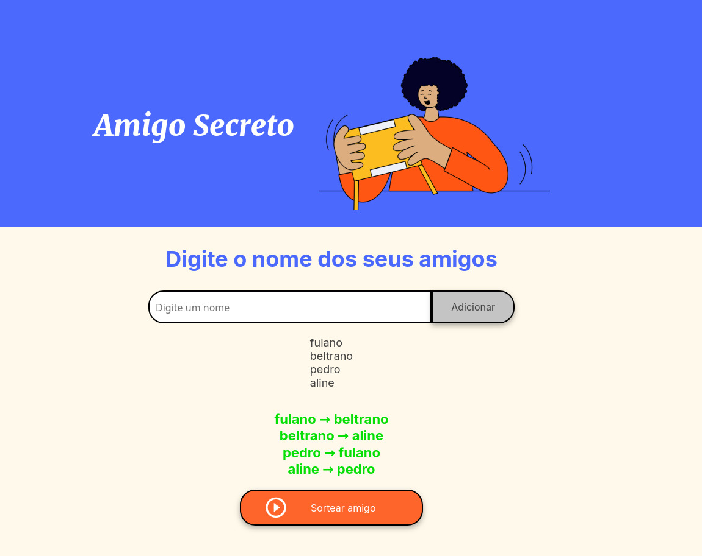

# Amigo Secreto 🎉

Uma aplicação simples e divertida para sortear amigos secretos de forma prática e interativa.

## 📋 Descrição

Este projeto foi desenvolvido como parte de um desafio para criar a lógica de uma aplicação que permite:
- Adicionar nomes de amigos em uma lista.
- Realizar o sorteio do amigo secreto.
- Garantir que nenhum participante tire a si mesmo.

## 🚀 Funcionalidades

- Adicione participantes à lista.
- Veja os nomes adicionados em tempo real.
- Realize o sorteio do amigo secreto de maneira justa e aleatória.
- Exiba o resultado diretamente na interface.

## 🛠️ Tecnologias Utilizadas

- **HTML5**: Estrutura da página.
- **CSS3**: Estilização da interface.
- **JavaScript**: Lógica do sorteio e manipulação do DOM.

- # 📸 Capturas de Tela
## Tela Inicial
## Resultado do Sorteio

